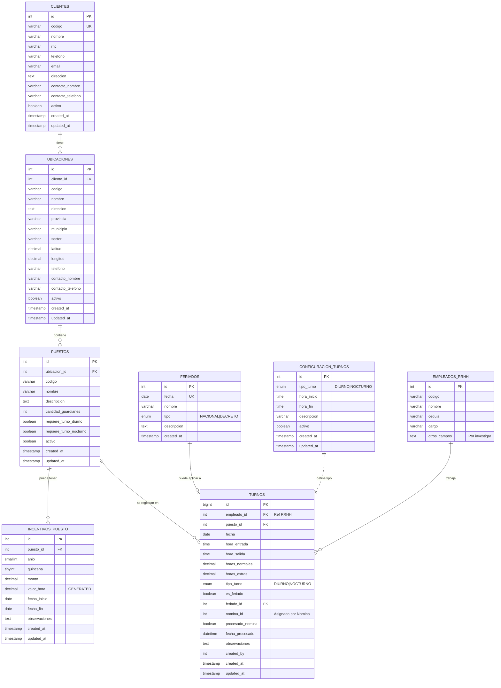

## Flujo del Sistema

```
┌─────────────────────────────────────────────────────────────────────────────┐
│                           FLUJO DE OPERACIÓN                                │
└─────────────────────────────────────────────────────────────────────────────┘

1. CONFIGURACIÓN INICIAL
   ┌──────────────┐    ┌──────────────┐    ┌──────────────┐
   │   Clientes   │───►│  Ubicaciones │───►│   Puestos    │
   └──────────────┘    └──────────────┘    └──────────────┘
                                                  │
                                                  ▼
                                          ┌──────────────┐
                                          │  Incentivos  │
                                          │ (Quincena)   │
                                          └──────────────┘

2. CONFIGURACIÓN DE TURNOS
   ┌───────────────────────────────────────────────────────┐
   │  DIURNO:   06:00 AM ─────────────► 06:00 PM          │
   │  NOCTURNO: 06:00 PM ─────────────► 06:00 AM          │
   └───────────────────────────────────────────────────────┘

3. REGISTRO DIARIO DE TURNOS
   ┌──────────────┐
   │  Guardián    │
   │  (Empleado)  │
   └──────┬───────┘
          │
          ▼
   ┌──────────────────────────────────────────────────────────┐
   │                    REGISTRO DE TURNO                      │
   ├──────────────────────────────────────────────────────────┤
   │  • Fecha                                                  │
   │  • Hora entrada / salida                                  │
   │  • Puesto asignado                                        │
   │  • Horas: Normales (10) + Extras (2)                     │
   │  • Auto-detecta: Tipo turno (D/N) + Feriado              │
   └──────────────────────────────────────────────────────────┘

4. GENERACIÓN DE REPORTE (Quincenal)
   ┌──────────────────────────────────────────────────────────┐
   │                    REPORTE CSV                            │
   ├──────────────────────────────────────────────────────────┤
   │  fecha | empleado_id | puesto | hrs_norm | hrs_ext |     │
   │  tipo_turno | es_feriado | tipo_feriado | incentivo      │
   └──────────────────────────────────────────────────────────┘
          │
          ▼
   ┌──────────────┐
   │   SISTEMA    │
   │   NÓMINA     │
   └──────────────┘


## Cálculo de Incentivos

┌─────────────────────────────────────────────────────────────────────────────┐
│  EJEMPLO: Incentivo de RD$3,600 para un puesto en una quincena             │
├─────────────────────────────────────────────────────────────────────────────┤
│                                                                             │
│  Valor por hora = RD$3,600 ÷ 360 horas = RD$10.00/hora                     │
│                   (15 días × 24 horas = 360 horas)                          │
│                                                                             │
│  ┌─────────────────────────────────────────────────────────────────────┐   │
│  │  Guardián A: Trabajó 120 horas → 120 × RD$10 = RD$1,200            │   │
│  │  Guardián B: Trabajó 180 horas → 180 × RD$10 = RD$1,800            │   │
│  │  Guardián C: Trabajó  60 horas →  60 × RD$10 = RD$600              │   │
│  │  ─────────────────────────────────────────────────────             │   │
│  │  TOTAL:      360 horas                        RD$3,600             │   │
│  └─────────────────────────────────────────────────────────────────────┘   │
│                                                                             │
│  Si un solo guardián trabaja las 360 horas, recibe TODO el incentivo       │
│                                                                             │
└─────────────────────────────────────────────────────────────────────────────┘


## Campos del Reporte CSV para Nómina

| Campo | Tipo | Descripción |
|-------|------|-------------|
| fecha | DATE | Fecha del turno trabajado |
| empleado_id | INT | ID del empleado (referencia a RRHH) |
| puesto_codigo | VARCHAR | Código del puesto |
| horas_normales | DECIMAL | Horas normales trabajadas (máx 10) |
| horas_extras | DECIMAL | Horas extras trabajadas (máx 2) |
| tipo_turno | ENUM | DIURNO o NOCTURNO |
| es_feriado | VARCHAR | SI / NO |
| tipo_feriado | VARCHAR | NACIONAL / DECRETO / N/A |
| incentivo | DECIMAL | Monto de incentivo calculado |
```
